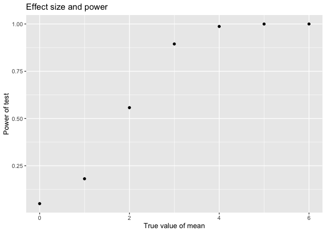
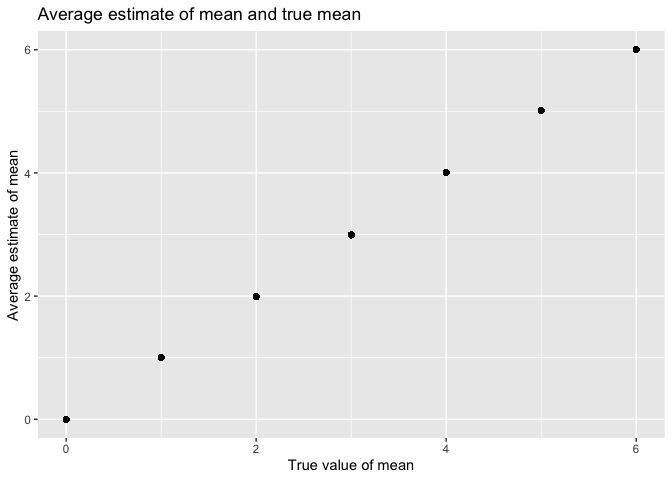
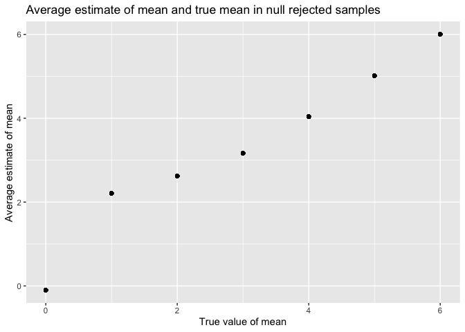

p8105_hw5_qs2261
================
Qinting Shen
2023-11-10

### Problem 1

#### Read data

``` r
homicide_raw = 
  read_csv("./homicide-data.csv") |> 
  janitor::clean_names()
```

    ## Rows: 52179 Columns: 12
    ## ── Column specification ────────────────────────────────────────────────────────
    ## Delimiter: ","
    ## chr (9): uid, victim_last, victim_first, victim_race, victim_age, victim_sex...
    ## dbl (3): reported_date, lat, lon
    ## 
    ## ℹ Use `spec()` to retrieve the full column specification for this data.
    ## ℹ Specify the column types or set `show_col_types = FALSE` to quiet this message.

the `homicide_raw` has 52179 observations and 12 variables.

``` r
# total number of homicides 
homicide_raw |> 
  mutate(city_state = paste(city, state, sep = ", ")) |> 
  group_by(city_state) |> 
  summarize(n()) 
```

    ## # A tibble: 51 × 2
    ##    city_state      `n()`
    ##    <chr>           <int>
    ##  1 Albuquerque, NM   378
    ##  2 Atlanta, GA       973
    ##  3 Baltimore, MD    2827
    ##  4 Baton Rouge, LA   424
    ##  5 Birmingham, AL    800
    ##  6 Boston, MA        614
    ##  7 Buffalo, NY       521
    ##  8 Charlotte, NC     687
    ##  9 Chicago, IL      5535
    ## 10 Cincinnati, OH    694
    ## # ℹ 41 more rows

``` r
# the number of unsolved homicides 
homicide_df = 
  homicide_raw |> 
  mutate(city_state = paste(city, state, sep = ", "),
         disposition = 
           ifelse(disposition %in% c("Closed without arrest", "Open/No arrest"), "unsolved", "solved")
         )|> 
  group_by(city_state, disposition)  |> 
  summarize(obs = n()) |> 
  pivot_wider(
    names_from = disposition, 
    values_from = obs) |> 
  summarize(unsolved)
```

    ## `summarise()` has grouped output by 'city_state'. You can override using the
    ## `.groups` argument.

### Peoblem 2

#### Import Data

``` r
filename = list.files("data", full.names = TRUE) # create a df containing all file names

importdata = function(path) {
  
  df = read_csv(path) |> 
    janitor::clean_names() |> 
    mutate(file = path)
}

longi_df = map(filename, importdata) |> 
  bind_rows()
```

#### Data Wrangling and Plotting

``` r
tidy_plot =
  longi_df |> 
  separate(file, into = c("folder","arm","underscore","subject_id","csv"), sep = c(5,8,9,11)) |> 
  mutate(arm_id = paste(arm, subject_id)) |> 
  select(-folder, -underscore, - csv) |> 
  select(arm, subject_id, everything()) |> 
  pivot_longer(
    week_1:week_8,
    names_to = "week",
    names_prefix = "week_",
    values_to = "observation" )|> 
  ggplot(aes(x = week, y = observation, group = arm_id, color = arm))+
    geom_line()

tidy_plot
```

<!-- -->

The spaghetti plot shows that the observations on each subject in
control group fluctuates but remain stable, while those in experimental
group are increasing over time. And compared to control group, the mean
values of observations of each subject are higher in experimental group.

### Peoblem 3

#### Create a function

``` r
set.seed(1)
one_samp = function(n= 30, mu, sigma = 5){
  
  sim_data = tibble(
    x = rnorm(n = n, mean = mu, sd = sigma),
  )
  broom::tidy(t.test(sim_data, mu = 0)) 
}
```

#### mu = 0, repeat 5000 times

``` r
ttest_mu_0 =
  rerun(5000, one_samp(mu = 0)) |> 
  bind_rows() |> 
  select(estimate, p.value)
```

#### Repeat for mu = 1,2,3,4,5,6

``` r
ttest_result = 
 tibble(true_mean = c(0, 1, 2, 3, 4, 5, 6)
        ) |> 
  mutate(
    output_list = map(.x = true_mean, ~ rerun(5000, one_samp(mu = .x))),
    estimate_df = map(output_list, bind_rows)
    )|>  
  unnest(estimate_df) |> 
  select(-output_list)
```

#### Plot 1: effect size and power

``` r
power_plot_df = 
  ttest_result |>
  group_by(true_mean) |>
  summarize(reject = sum(p.value < 0.05)/5000) |>
  ggplot(aes(x = true_mean, y = reject)) +
  geom_point() +
  labs(
    title = "Effect size and power",
    x = "True value of mean",
    y = "Power of test"
  )

power_plot_df
```

<!-- -->

The plot shows that the power increases as the true value increases.
This is because a larger effect size is associated with increased power,
making it easier to detect the statistically significant difference.

#### Plot 2: average estimate of mean and true mean

``` r
plot_avg_mean= 
  ttest_result |> 
  group_by(true_mean) |> 
  mutate(avg_mean = mean(estimate)) |> 
  ggplot(aes(x = true_mean, y = avg_mean ))+
  geom_point()+
  labs(
    title = "Average estimate of mean and true mean",
    x = "True value of mean",
    y = "Average estimate of mean"
  )

plot_avg_mean
```

<!-- -->

#### Plot null rejected

``` r
plot_null_reject =  
  ttest_result |> 
  filter(p.value < 0.05) |> 
  group_by(true_mean) |> 
  mutate(avg_mean = mean(estimate)) |> 
  ggplot(aes(x = true_mean, y = avg_mean ))+
  geom_point()+
  labs(
    title = "Average estimate of mean and true mean in null rejected samples",
    x = "True value of mean",
    y = "Average estimate of mean"
  )

plot_null_reject
```

<!-- -->

The sample average of μ̂ across tests for which the null is rejected is
approximately equal to the true value of μ.

Because these samples are also randomly generated from this normal
distribution, and the number of the samples is large, their distribution
tend to be symmetric to the true mean. Therefore, their average mean
value is still close to the true mean.
